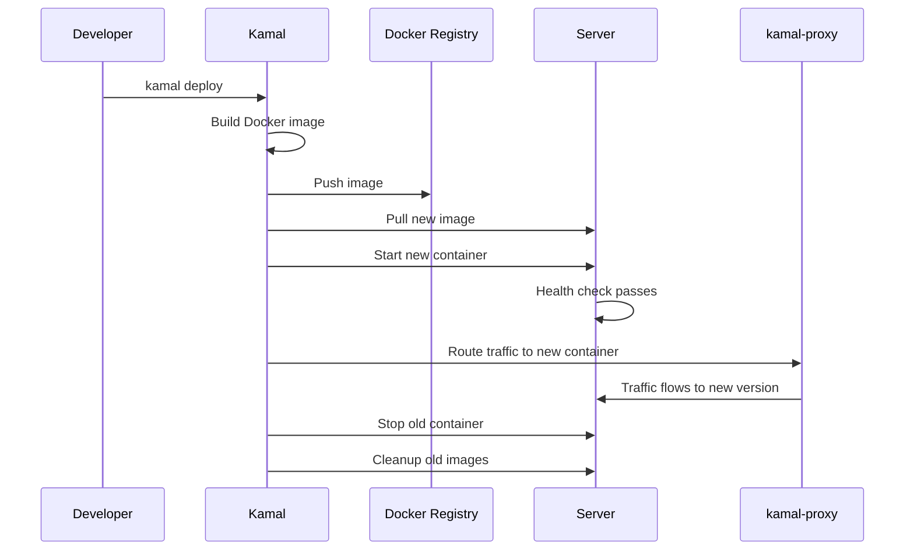

# Introduction to Kamal

Kamal is a powerful deployment tool that lets you deploy web apps to bare metal or cloud VMs with **zero downtime**. Originally built for Rails applications at Basecamp, Kamal works with any web application that can be containerized with Docker.

## What is Kamal?

Kamal uses [kamal-proxy](https://github.com/basecamp/kamal-proxy) to seamlessly switch requests between containers during deployments, ensuring your application stays available to users throughout the deployment process. It works across multiple servers using SSHKit to execute commands remotely.

<CardGroup cols={2}>
  <Card title="Zero Downtime" icon="arrows-rotate">
    Kamal-proxy seamlessly switches traffic between old and new containers, ensuring continuous availability during deployments.
  </Card>
  <Card title="Deploy Anywhere" icon="server">
    From bare metal servers to cloud VMs, deploy to any infrastructure running Docker with SSH access.
  </Card>
  <Card title="Multi-Server Support" icon="network-wired">
    Deploy across multiple servers with automatic coordination and health checks.
  </Card>
  <Card title="Language Agnostic" icon="code">
    Works with any web application that can be containerized - Rails, Node.js, Python, Go, and more.
  </Card>
</CardGroup>

## Why Use Kamal?

### Simplicity
Kamal provides a simple, unified interface for deploying containerized applications. No need to learn complex orchestration systems - just configure your deployment and run `kamal deploy`.

### Cost-Effective
Deploy directly to your servers without expensive platform-as-a-service fees. Kamal works on affordable VPS providers like DigitalOcean, Hetzner, Linode, or your own hardware.

### Full Control
You maintain complete control over your infrastructure. Kamal doesn't lock you into any specific platform or vendor.

### Production-Ready
Built and battle-tested by Basecamp for deploying production applications, Kamal is trusted to handle real-world traffic and deployment scenarios.

## Key Features

<Steps>
  <Step title="Automated Docker Setup">
    Kamal can automatically install and configure Docker on your servers, handling user permissions and group setup.
  </Step>
  
  <Step title="Zero-Downtime Deployments">
    Uses kamal-proxy to route traffic seamlessly between container versions during deployments.
  </Step>
  
  <Step title="Health Checks">
    Built-in health checks ensure new containers are ready before receiving traffic.
  </Step>
  
  <Step title="Rolling Deployments">
    Configure batched, rolling deploys to update servers gradually with configurable wait times.
  </Step>
  
  <Step title="Accessory Services">
    Manage supporting services like databases, Redis, and search engines alongside your application.
  </Step>
  
  <Step title="Asset Bridging">
    Bridge fingerprinted assets between versions to prevent 404 errors on in-flight requests.
  </Step>
  
  <Step title="SSL/TLS Support">
    Automatic SSL certificate management with Let's Encrypt integration.
  </Step>
  
  <Step title="Environment Variables & Secrets">
    Secure management of environment variables and secrets with integration for 1Password, LastPass, and Bitwarden.
  </Step>
</Steps>

## How It Works

<Note>
  Kamal coordinates all deployment steps automatically, ensuring safe, zero-downtime deployments across all your servers.
</Note>

## Who Should Use Kamal?

Kamal is ideal for:

- **Developers** who want simple, cost-effective deployments without complex orchestration
- **Startups** looking to minimize infrastructure costs while maintaining professional deployments
- **Teams** migrating away from expensive PaaS solutions
- **DevOps engineers** who want straightforward container deployments without Kubernetes complexity

## What's Next?

<CardGroup cols={2}>
  <Card title="Installation" icon="download" href="/installation">
    Install Kamal and set up your development environment
  </Card>
  <Card title="Quick Start" icon="rocket" href="/quickstart">
    Deploy your first application with Kamal in minutes
  </Card>
</CardGroup>

<Tip>
  Kamal is open source and released under the MIT License. Contributions are welcome on [GitHub](https://github.com/basecamp/kamal).
</Tip>